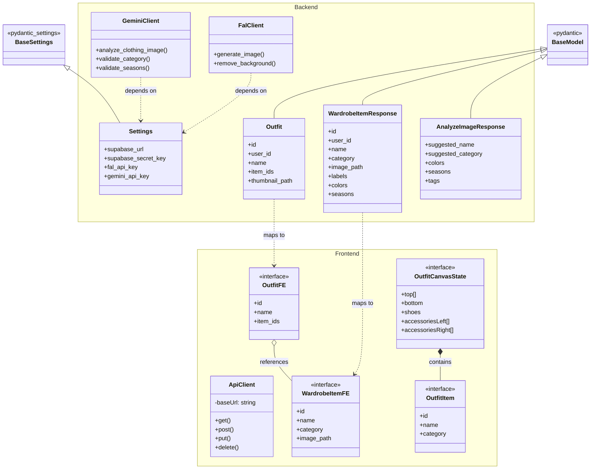

# UML Class Diagram (Mermaid)

## Full Diagram

```mermaid
classDiagram
    direction TB

    %% External Libraries
    class BaseModel {
        <<pydantic>>
    }
    class BaseSettings {
        <<pydantic_settings>>
    }

    %% ============================================
    %% BACKEND CLASSES
    %% ============================================
    namespace Backend {
        %% Configuration
        class Settings {
            +supabase_url: str
            +supabase_secret_key: str
            +fal_api_key: str
            +gemini_api_key: str
        }
        
        %% Services
        class GeminiClient {
            +model: GenerativeModel
            +__init__()
            +analyze_clothing_image(image_data: bytes, mime_type: str) Dict[str, Any]
            +validate_category(category: str) str
            +validate_seasons(seasons: List[str]) List[str]
        }
        
        class FalClient {
            +__init__()
            +generate_image(image_url: str, prompt: str) dict
            +remove_background(image_url: str) str
        }
        
        %% API Models
        class GenerateAvatarRequest {
            +user_id: str
        }
        
        class WardrobeItem {
            +name: str
            +category: str
            +labels: Optional[List[str]]
            +colors: Optional[List[str]]
            +seasons: Optional[List[str]]
        }
        
        class WardrobeItemResponse {
            +id: str
            +user_id: str
            +name: str
            +category: str
            +image_path: Optional[str]
            +labels: List[str]
            +colors: List[str]
            +seasons: List[str]
            +is_inspiration: bool
            +is_template: bool
            +created_at: str
            +updated_at: str
        }
        
        class UpdateWardrobeItem {
            +name: Optional[str]
            +category: Optional[str]
            +labels: Optional[List[str]]
            +colors: Optional[List[str]]
            +seasons: Optional[List[str]]
        }
        
        class RemoveBackgroundRequest {
            +image_url: str
        }
        
        class RemoveBackgroundResponse {
            +processed_image_url: str
            +storage_path: str
        }
        
        class AnalyzeImageResponse {
            +suggested_name: str
            +suggested_category: str
            +colors: List[str]
            +seasons: List[str]
            +tags: List[str]
            +style: List[str]
            +material_guess: str
            +confidence: str
        }
        
        class Outfit {
            +id: str
            +user_id: str
            +name: Optional[str]
            +item_ids: List[str]
            +thumbnail_path: Optional[str]
            +created_at: str
            +updated_at: str
        }
        
        class OutfitCreate {
            +name: Optional[str]
            +item_ids: List[str]
        }
        
        class OutfitUpdate {
            +name: Optional[str]
            +item_ids: Optional[List[str]]
        }
    }

    %% Inheritance - Backend
    BaseSettings <|-- Settings
    BaseModel <|-- GenerateAvatarRequest
    BaseModel <|-- WardrobeItem
    BaseModel <|-- WardrobeItemResponse
    BaseModel <|-- UpdateWardrobeItem
    BaseModel <|-- RemoveBackgroundRequest
    BaseModel <|-- RemoveBackgroundResponse
    BaseModel <|-- AnalyzeImageResponse
    BaseModel <|-- Outfit
    BaseModel <|-- OutfitCreate
    BaseModel <|-- OutfitUpdate

    %% Dependencies - Backend
    GeminiClient ..> Settings : depends on
    FalClient ..> Settings : depends on

    %% ============================================
    %% FRONTEND CLASSES
    %% ============================================
    namespace Frontend {
        %% Main API Client
        class ApiClient {
            -baseUrl: string
            +constructor(baseUrl: string)
            -getAuthToken() Promise[string | null]
            -request[T](endpoint: string, options: RequestOptions) Promise[T]
            +get[T](endpoint: string, options: RequestOptions) Promise[T]
            +post[T](endpoint: string, body: unknown, options: RequestOptions) Promise[T]
            +put[T](endpoint: string, body: unknown, options: RequestOptions) Promise[T]
            +delete[T](endpoint: string, options: RequestOptions) Promise[T]
        }
        
        %% Auth Types
        class AuthUser {
            <<interface>>
            +id: string
            +email: string
        }
        
        class LoginFormData {
            <<interface>>
            +email: string
            +password: string
        }
        
        class SignupFormData {
            <<interface>>
            +email: string
            +password: string
            +confirmPassword: string
        }
        
        %% Wardrobe Types
        class WardrobeItemFE {
            <<interface>>
            +id: string
            +user_id: string
            +name: string
            +category: Category
            +image_path: string | null
            +labels: string[]
            +colors: string[]
            +seasons: string[]
            +is_inspiration: boolean
            +is_template: boolean
            +created_at: string
            +updated_at: string
        }
        
        class CreateWardrobeItemInput {
            <<interface>>
            +name: string
            +category: Category
            +labels?: string[]
            +colors?: string[]
            +seasons?: string[]
            +image?: File
            +imagePath?: string
        }
        
        class UpdateWardrobeItemInput {
            <<interface>>
            +name?: string
            +category?: Category
            +labels?: string[]
            +colors?: string[]
            +seasons?: string[]
        }
        
        class WardrobeFilters {
            <<interface>>
            +category?: Category
            +search?: string
            +colors?: string[]
            +seasons?: Season[]
        }
        
        class AIAnalysisResult {
            <<interface>>
            +suggested_name: string
            +suggested_category: string
            +colors: string[]
            +seasons: string[]
            +tags: string[]
            +style: string[]
            +material_guess: string
            +confidence: string
        }
        
        %% Outfit Types
        class OutfitFE {
            <<interface>>
            +id: string
            +user_id: string
            +name: string | null
            +item_ids: string[]
            +thumbnail_path: string | null
            +created_at: string
            +updated_at: string
        }
        
        class OutfitItem {
            <<interface>>
            +id: string
            +name: string
            +category: Category
            +image_path: string | null
        }
        
        class OutfitCanvasState {
            <<interface>>
            +top: OutfitItem[]
            +bottom: OutfitItem | null
            +shoes: OutfitItem | null
            +accessoriesLeft: OutfitItem[]
            +accessoriesRight: OutfitItem[]
        }
        
        class OutfitCreateInput {
            <<interface>>
            +name?: string
            +item_ids: string[]
        }
        
        class OutfitUpdateInput {
            <<interface>>
            +name?: string
            +item_ids?: string[]
        }
        
        %% Profile Types
        class Profile {
            <<interface>>
            +id: string
            +display_name: string | null
            +onboarding_completed: boolean
            +tutorial_completed: boolean
            +created_at: string
            +updated_at: string
        }
        
        class Avatar {
            <<interface>>
            +id: string
            +user_id: string
            +original_photo_path: string | null
            +model_canvas_path: string | null
            +model_status: ModelStatus
            +is_active: boolean
            +created_at: string
            +updated_at: string
        }
        
        %% API Client Types
        class RequestOptions {
            <<interface>>
            +body?: unknown
        }
        
        class ApiError {
            <<interface>>
            +status: number
            +message: string
        }
    }

    %% Composition
    OutfitCanvasState *-- OutfitItem : contains

    %% Aggregation
    OutfitFE o-- WardrobeItemFE : references via item_ids

    %% Dependencies - Frontend
    CreateWardrobeItemInput ..> WardrobeItemFE : creates
    UpdateWardrobeItemInput ..> WardrobeItemFE : updates
    OutfitCreateInput ..> OutfitFE : creates
    OutfitUpdateInput ..> OutfitFE : updates
    ApiClient ..> AuthUser : uses

    %% Backend to Frontend Mapping
    WardrobeItemResponse ..> WardrobeItemFE : maps to
    AnalyzeImageResponse ..> AIAnalysisResult : maps to
    Outfit ..> OutfitFE : maps to
```



---

## Simplified Diagram (Overview)



---

## Relationship Types Legend

| Line Style | Meaning |
|------------|---------|
| `──▶` | Inheritance (extends) |
| `──►` | Dependency (uses) |
| `──◆` | Composition (owns) |
| `──◇` | Aggregation (has) |

---

## Type Aliases

```typescript
// Wardrobe Types
type Category = 'tops' | 'bottoms' | 'dresses' | 'shoes' | 'accessories' | 'outerwear'
type Season = 'spring' | 'summer' | 'fall' | 'winter'

// Outfit Types  
type OutfitSlot = 'top' | 'bottom' | 'shoes' | 'accessoriesLeft' | 'accessoriesRight'
type MainCategory = 'top' | 'bottoms' | 'shoes' | 'accessories'

// Profile Types
type ModelStatus = 'pending' | 'processing' | 'ready' | 'failed'
```