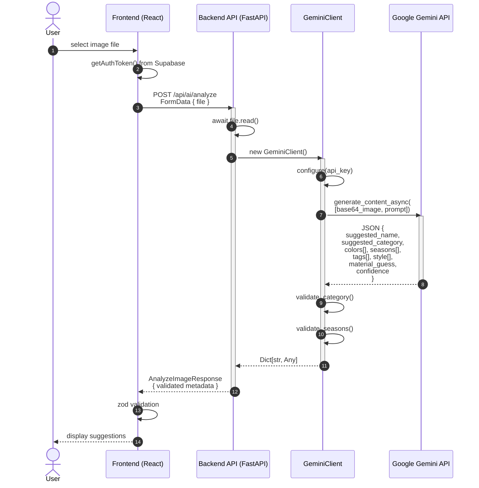
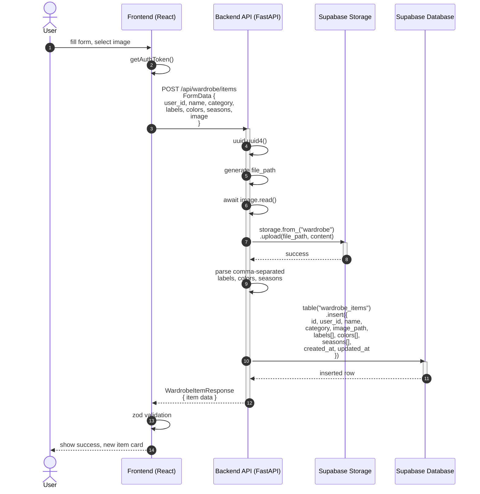
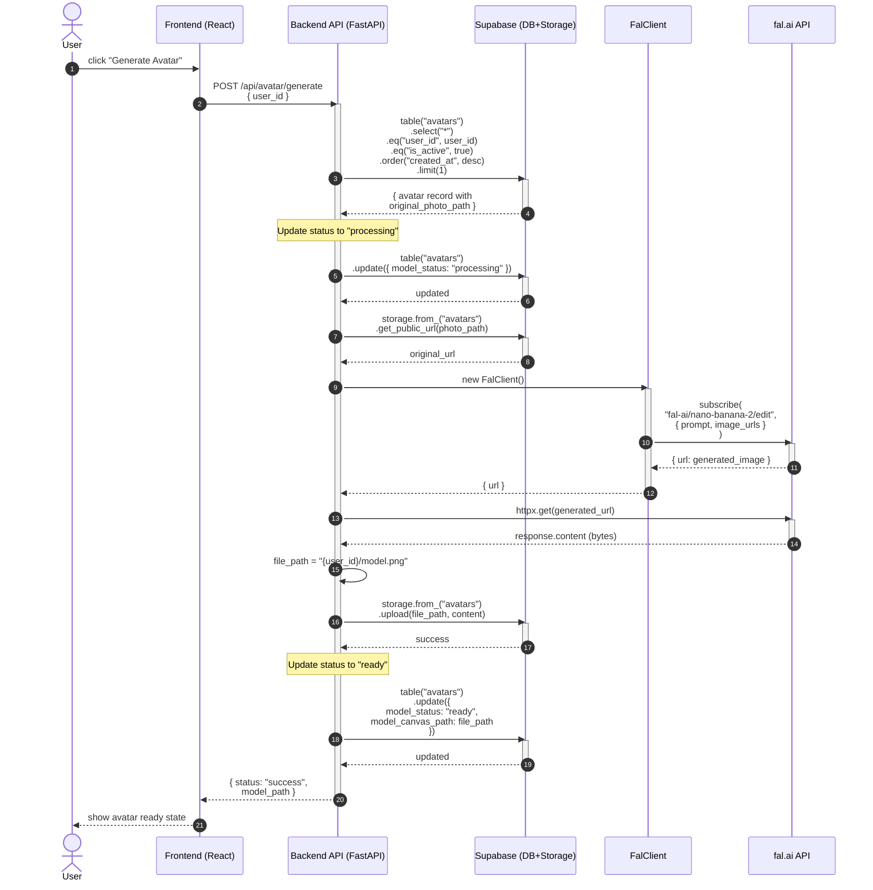
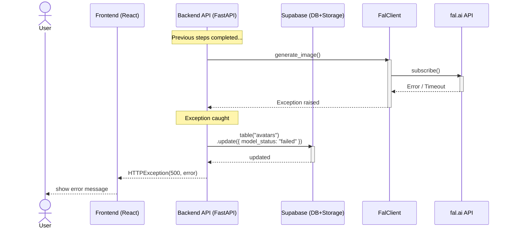
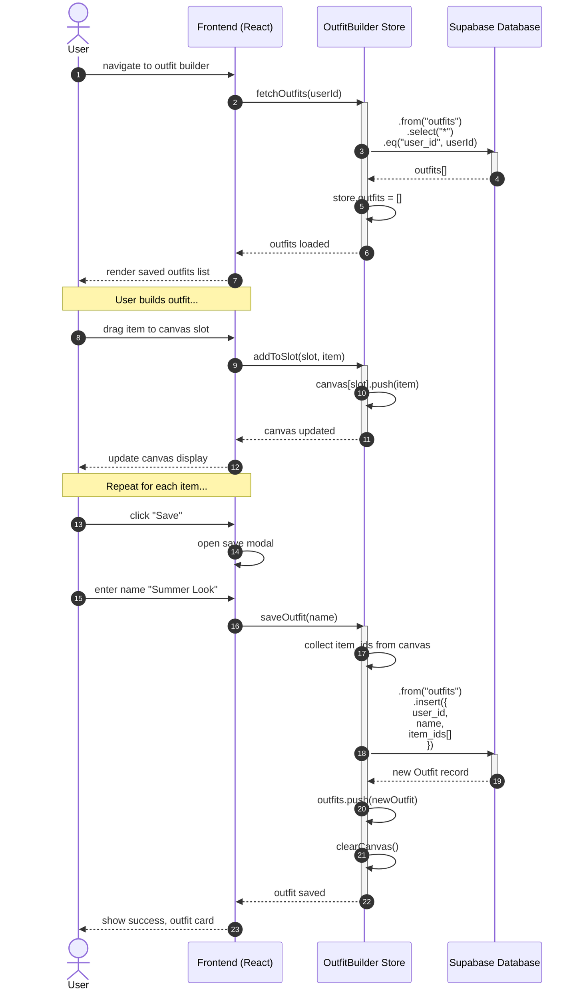
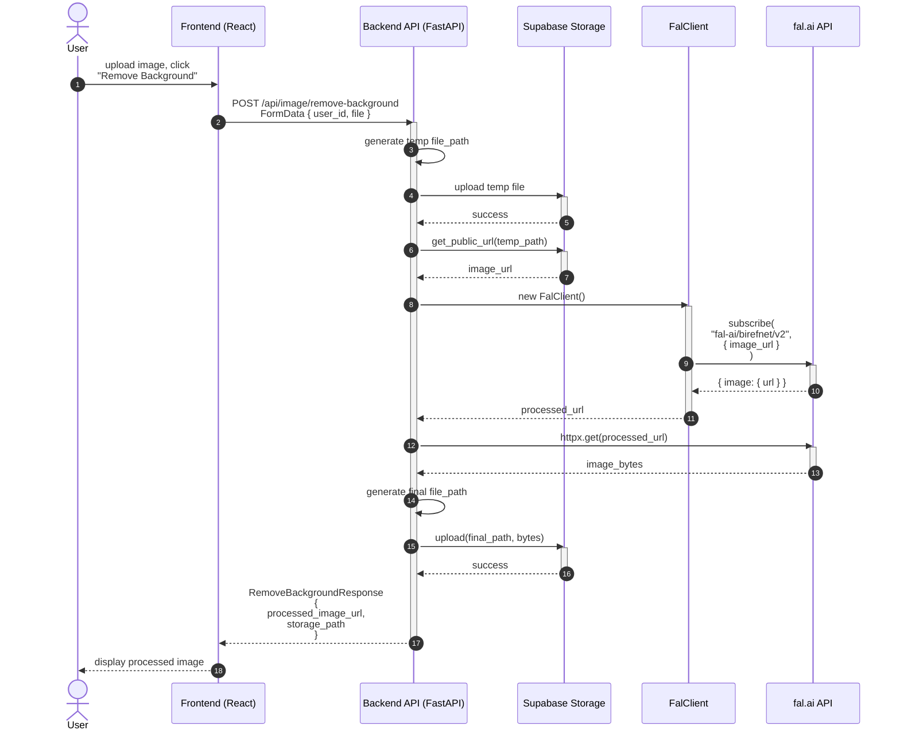

# UML Sequence Diagrams (Mermaid Format)

## Diagram 1: AI Image Analysis Flow



---

## Diagram 2: Wardrobe Item Creation Flow



---

## Diagram 3: Avatar Generation Flow



### Error Flow (Avatar Generation)



---

## Diagram 4: Outfit Creation & Save Flow



---

## Diagram 5: Background Removal Flow



---

## Summary

| Flow | Actors | Key Operations | External Services |
|------|--------|----------------|-------------------|
| AI Analysis | User, Frontend, Backend, GeminiClient | Image upload, AI processing, validation | Google Gemini |
| Create Item | User, Frontend, Backend, Supabase | Form submission, file upload, DB insert | Supabase |
| Generate Avatar | User, Frontend, Backend, FalClient | Status updates, AI generation, storage | fal.ai |
| Save Outfit | User, Frontend, Store, Supabase | Canvas state management, DB insert | Supabase (direct) |
| Remove Background | User, Frontend, Backend, FalClient | Image processing, storage | fal.ai |

---

## Key Patterns

### Authentication Flow
All API calls follow this pattern:
1. Frontend calls `getAuthToken()` from Supabase
2. Token added to `Authorization: Bearer {token}` header
3. Backend validates token (via Supabase client)

### Error Handling
```
Frontend → API → Service → External API
                ↓
         On exception:
         1. Log error
         2. Update state if needed (e.g., model_status = "failed")
         3. Return HTTPException
         4. Frontend shows error message
```

### State Updates
- **Avatar Generation**: `model_status` transitions: `null → "processing" → "ready"` or `"failed"`
- **Outfit Builder**: Canvas state managed in Zustand store
- **Wardrobe**: Items cached in store after fetch